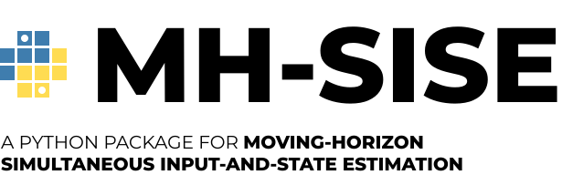

This repository implements a **Moving-Horizon Simultaneous Input-and-State Estimation** (MH-SISE) problem in Python. The MH-SISE algorithm estimates both inputs and states of a dynamic system over a moving horizon. 

A [DPP-complient](https://www.cvxpy.org/tutorial/dpp/index.html) optimization problem is defined using `CVXPY`. For real-time applications, the package can generate a high-speed C-solver using `CVXPYGEN`. 

# Method
We consider a discrete-time linear time-invariant (LTI) system of the form:

$$
\begin{align*}
x_{k+1} &= Ax_k + Bu_k + w_k \\
y_k &= Cx_k + v_k
\end{align*}
$$

Where:
- $x_k \in \mathbb{R}^n$ represents the system state at time step $k$,
- $u_k \in \mathbb{R}^m$ is the control input at time step $k$,
- $y_k \in \mathbb{R}^p$ is a vector of measured outputs at time step $k$,
- $w_k \in \mathbb{R}^n$ and $v_k \in \mathbb{R}^p$ are process and measurement noise, respectively,
- $A \in \mathbb{R}^{n \times n}$, $B \in \mathbb{R}^{n \times m}$, and $C \in \mathbb{R}^{p \times n}$ are system matrices describing the dynamics and observation model.

To estimate both the states $x_k$ and the inputs $u_k$ over a moving horizon of length $N$, the package solves the following quadratic constrainted (QP) optimization problem:

$`
\begin{aligned}
    &\underset{x, u}{\mathrm{minimize}} \quad L(u) + \sum_{n=k-N}^{k} v_n^T Q_v^{-1} v_n + \sum_{n=k-N}^{k} w_n^T Q_w^{-1} w_n \\
    &\text{subject to} \\
    &x_{n} = A x_{n-1} + B u_{n-1} + w_n, &n = k-N, \dots, k \\
    &y_n = C x_n + v_n, &n = k-N, \dots, k \\
    &x_0 = \hat{x}_{k-N-1|k-N-1} \\
    &u \in \mathcal{C},
\end{aligned}
`$

where:
- $Q_v \in \mathbb{R}^{p \times p}$, $Q_w \in \mathbb{R}^{n \times n}$ are covariande matrices of measurement noise $v_n$, process noise $w_n$, respectively.
- $L(u)$ is a regularization term designed by the user.
- $\mathcal{C}$ is a convex set defined by the user.
- $\hat{x}_{k-N-1}$ is an estimatie of the initial state.

This formulation leads to a convex optimization problem, which is solved using the `cvxpy` optimization framework, and code generation for real-time applications is handled by `cvxpygen`.

# Installation
### Python version
This project is developed ``Python 3.12.4`` and has not been tested for other versions.

### Install the MH-SISE package
Clone repository and install `mh_sise`  in **editable** mode using:

```bash
pip install -e .
```

This will install the package and allow you to modify the code without needing to reinstall it. Now you can import `mh_sise` in your Python projects:

```python
from mh_sise.problem import Problem
```
### Requirementes
To run the code in this project, you'll need to install the following Python packages:

- `numpy` for numerical operations.
- `cvxpy` for convex optimization.
- `cvxpygen` for code ceneration.
- `scipy` for linear algebra and control-related oprations.
- `matplotlib` for plotting and visualization.

Install the dependencies with:

```bash
pip install -r requirements.txt
```

# Example usage
This example outlines the process of creatign and solving an MH-SISE problem. The following example steps through the process of defining an MH-SISE problem for a system with $m$ inputs, $n$ states, and $p$ outputs. Estimation happens on a moving horizon with length $N$.

The complete example is provided in:
- MH-SISE Example, [example.ipynb](https://github.com/Novia-RDI-Seafaring/mh-sise-py/blob/main/examples/example_cart.ipynb)

## Create an optimization problem
The class `Problem` in the `mh-sise` package creates a DPP-complient optimization problem of the form

$`
\begin{aligned}
    &\underset{X, U, V, W}{\mathrm{minimize}} \quad L(U) + \| Q_v^{-1/2} V \|_F^2 + \| Q_w^{-1/2} W \|_F^2 \\
    &\text{subject to} \\
    &X_{:,1:N} = AX_{:,:N-1} + BU \\
    &Y = CX + V \\
    &W_{:,1:} = X_{:,1:N} - AX_{:,:N-1} - BU, \\
    &W_{:,0} = X_{:,0} - \hat{x}_0 \\
    &U \in \mathcal{C}.
\end{aligned}
`$

The regularization term $L(U)$ and constraints $U \in \mathcal{C}$ are to be defined by the user. The "mother" problem without regularization $L(U)$ and constraints $U \in \mathcal{C}$ is defined as:

```python
from mh_sise.problem import Problem

p = n_outputs
m = n_inputs
n = n_states

problem = Problem(n, m, p, N)
```
### Add parameters
This is how you add additional parameters beyond the ones defined in the "mother" problem above. Here parameters $b\in\mathbb{R}$ and $Q_u^{-1/2} \in \mathbb{R}^{m \times m}$ are added to the problem.

```python
problem.add_parameter(shape=(m,m), name='Q_u_inv_sqrt')
problem.add_parameter(shape=1, name='b')
```
### Add regularization
Here the regularization term $`L(U) = \| Q_u^{-1/2} U \|_F
^2`$ is added to the problem.
```python
import cvxpy as cp

# create the regularization term
expression = cp.sum_squares(problem.Q_u_inv_sqrt @ problem.U)
problem.add_regularization(expression)
```

### Add constraints
This is how you add additional constraints not defined in the mother problem. Here the constraint $|U| \leq b$ is added.
```python
# create a constraint
new_constraint = cp.abs(problem.U) <= problem.b

# add constraint to problem
problem.add_constraints(new_constraint)
```
### Add variables
It is sometimes necessary to add additional variables beyond those included in the mother problem. Variables are added as follows:

```python
problem.add_variable(shape, name)
```

### Assign parameter values
Parameter values are assigned as follows. It is also possible to assign values to a subset of all parameters.

```python
problem.assign_parameter_values(
    Q_v_inv_sqrt = Q_v_inv_sqrt,
    Q_w_inv_sqrt = Q_w_inv_sqrt,
    Q_u_inv_sqrt = Q_u_inv_sqrt,
    A = A,
    B = B,
    C = C,
    x0 = x0,
    y = y,
    b = b
)
```

### Solve the problem with CVXPY
Solve the problem with `cvxpy` with the following command: 
```python
problem.solve()
```

## Generate high-speed C-solver code
Here we will step through how to generate C code using `CVXPYGEN` for the problem above above.

### Generate C-code with CVXPYGEN
```python
problem.generate_code(pth, name)
```
where `pth` is the path to where the solved is to be saved, and `name` is the name you want to give the solver.

### Load the C-solver code in Python
```python
from mh_sise.problem import CProblem
from codegen.<<pth_to_solver>>.cpg_solver import cpg_solve

cproblem = CProblem(pth=pth_to_solver)
```

### Assign parameter values
Parameter values are assigned to the  C solver as follows. It is also possible to assign values to a selection of the parameters.

```python
cproblem.assign_parameter_values(
    Q_v_inv_sqrt = Q_v_inv_sqrt,
    Q_w_inv_sqrt = Q_w_inv_sqrt,
    Q_u_inv_sqrt = Q_u_inv_sqrt,
    A = A,
    B = B,
    C = C,
    x0 = x0,
    y = y,
    b = b
)
```
### Solve the problem with the C-solver
```python
cproblem.solve(cpg_solve)
```

# Citation

If you use this package in your research, please cite it using the following BibTeX entry:

```bibtex
@misc{mh-sise-py,
  author = {Manngård, Mikael and Bouzoulas, Dimitrios and Hakonen, Urho and Kronqvist, Jan},
  title = {{MH-SISE-PY}: A Python Package for Moving-Horizon Simultaneous Input-and-State Estimation},
  year = {2024},
  howpublished = {\url{https://github.com/Novia-RDI-Seafaring/mh-sise-py}},
}
```

# Main contributors
- **Mikael Manngård**, (Novia UAS). Contributed with the MH-SISE formulation.
    - CRediT: *Conceptualization*, *Methodology*, *Software*, *Formal analysis*, *Supervision*. 
- **Dimitrios Bouzoulas** (Novia UAS). Contributed with the code-generation work with `cvxpygen`.
    - CRediT: *Software*, *Validation*.
- **Urho Hakonen** (Aalto University). This work is a continuation and implementation of ([Hakonen, 2023](https://www.finna.fi/Record/aaltodoc.123456789_123180?sid=3456825094&lng=en-gb)).
    - CRediT: *Methodology*, *Validation*. 
- **Jan Kronqvist** (KTH).
    - CRediT: *Supervision*. 

# Acknowledgements
This work was done in the Business Finland funded project [Virtual Sea Trial](https://virtualseatrial.fi).
